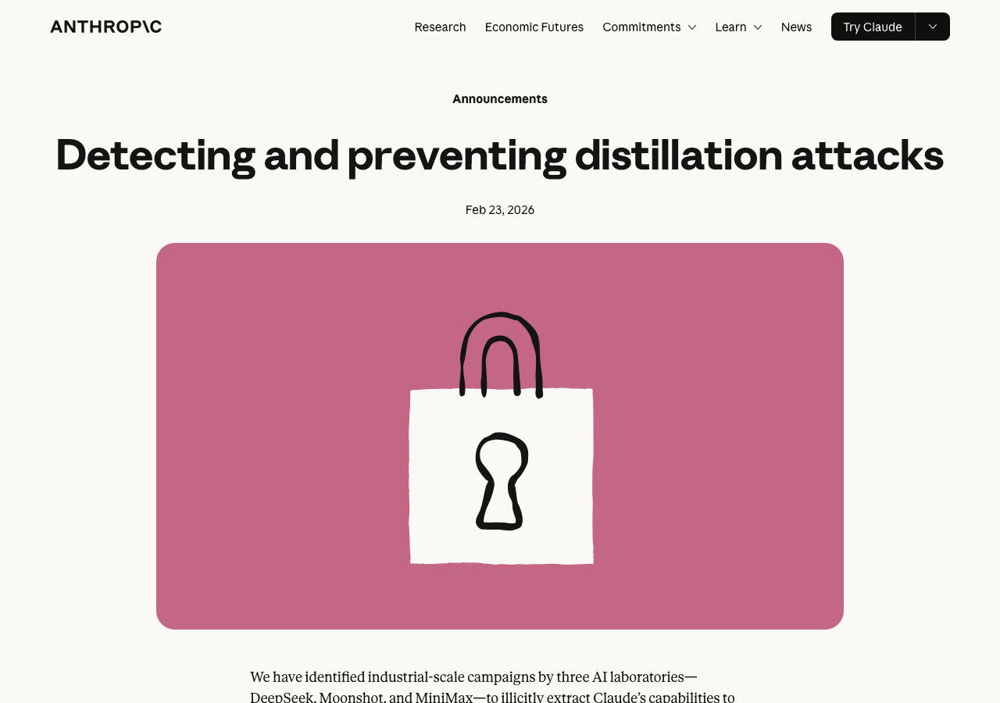
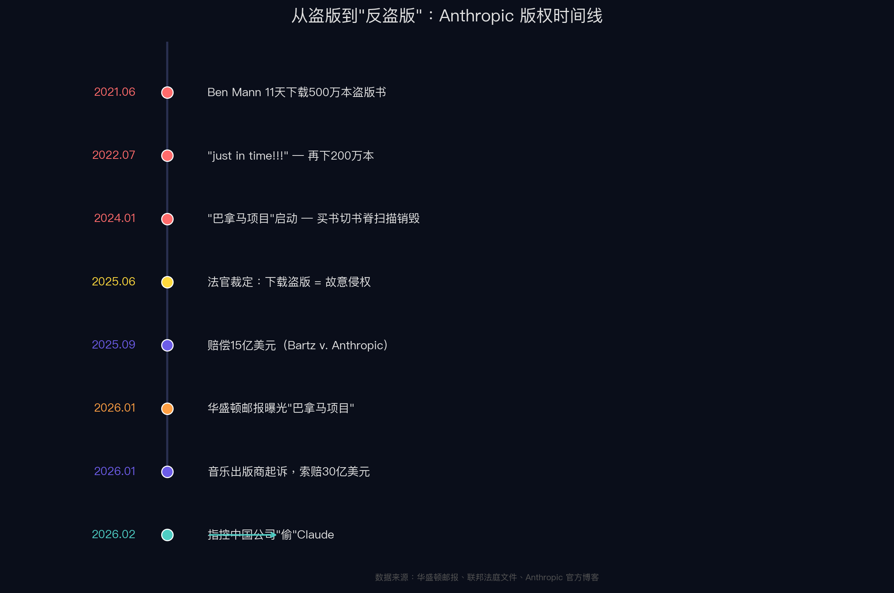
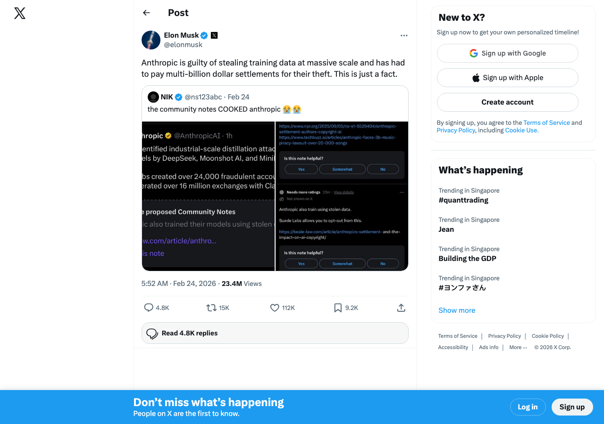
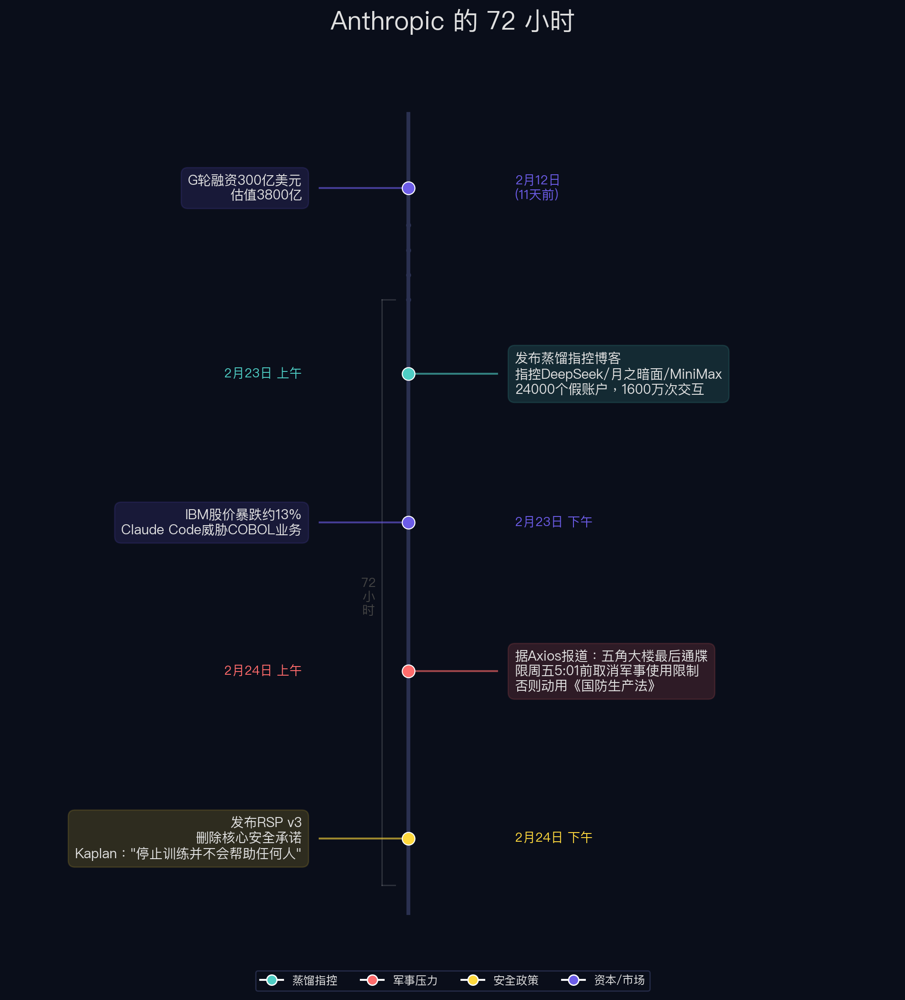
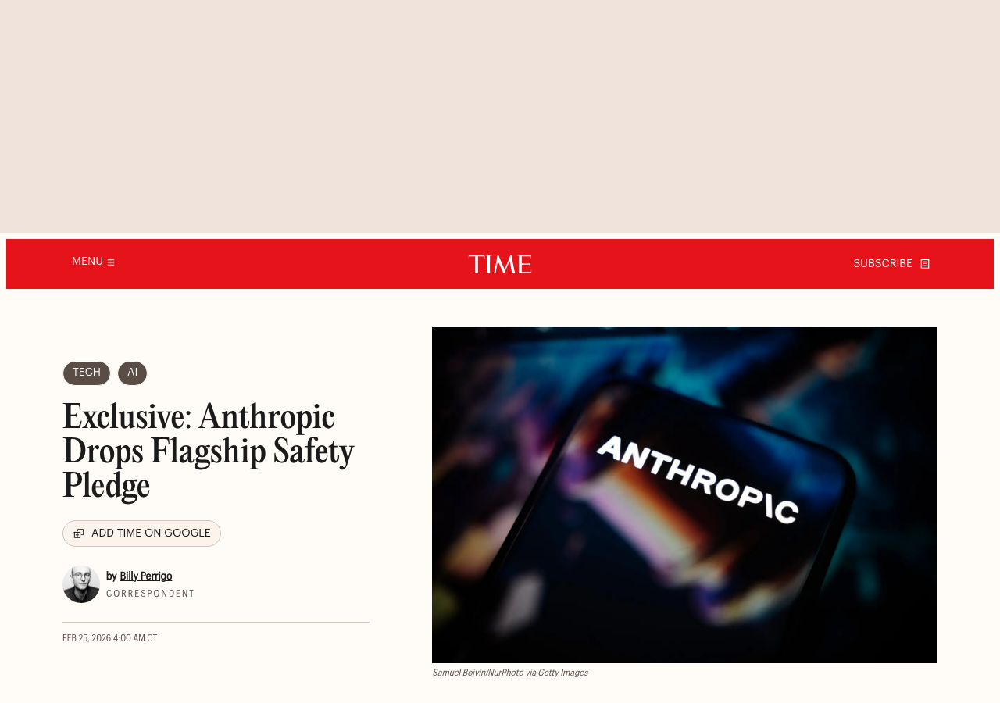

有个细节挺有意思。

2025 年 1 月底，DeepSeek R1 刚发布，就有用户发现：问它"你叫什么名字"，思维链里冒出一句——**"My official name is Claude, created by Anthropic."**

不是最终回答，是推理过程中的自言自语。同一个模型，被问"你能不能绕过你的规则"，回答是："My guidelines are set by OpenAI."

DeepSeek 没否认。几小时后悄悄加了系统提示词修复。据报道，GitHub issue 被标记为"自我认知错误"。

一年多后，这个"认知错误"会以完全不同的方式出现在新闻里。

---

## 第一条线：指控

2026 年 2 月 23 日，Anthropic 在官网发博客：《检测与防止蒸馏攻击》。

核心指控：中国三家 AI 实验室——**DeepSeek、月之暗面、MiniMax**——通过约 **24,000 个虚假账户**，与 Claude 产生超过 **1600 万次对话交互**，提取能力来训练自己的模型。

逐个看：

- **MiniMax**：1300 万次，占了大头。Anthropic 说 MiniMax 在新模型发布 24 小时内，把近一半流量重定向到新模型——时间窗口吻合 MiniMax 产品路线图。
- **月之暗面**：340 万次，瞄准智能体推理、工具调用、代码能力。通过请求元数据锁定了高管的公开资料。
- **DeepSeek**：15 万次。1600 万总量里不到 1%。但名字在标题最显眼的位置。

**检测方法**：不是靠"模型说了我是谁"——博客里根本没提身份混淆。实际靠 IP 关联、请求元数据、行为指纹，和"九头蛇集群"——2 万多个假账户把合法请求和提取流量混在一起。Anthropic 还说"行业伙伴"在自己平台上观察到了相同行为。

如果 Anthropic 的指控属实，MiniMax 的 24 小时流量转向是强信号。**但 Anthropic 没有公布任何原始日志或可独立验证的取证材料。** Hacker News 排名最高的评论：提交原始日志，接受第三方审计。三家被指控公司？全部沉默。

博客还上升到了国家安全层面——声称蒸馏可能移除安全护栏，用于"进攻性网络行动、虚假信息运动和大规模监控"。

---

## 第二条线：Anthropic 自己的数据来源

指控别人"偷"之前，看看自己的手。

**2021 年 6 月**，联合创始人 **Ben Mann** 花 11 天从 LibGen 下载了至少 **500 万本**盗版书。庭审中他说认为这属于"合理使用"——在 OpenAI 工作时形成的认知。

**2022 年 7 月**，Pirate Library Mirror 上线，首页写着"故意违反版权法"。内部人员转发给同事：**"just in time!!!"** 同月再下 **200 万本**。

内部有人写了：如果媒体发现"我们使用了明知是盗版的数据集，可能损害我们与监管机构的谈判地位。"

**2024 年初**，代号**"巴拿马项目"**启动。2026 年 1 月联邦法官解封的 4000 多页诉讼文件显示，规划文档原文写道：

> **"这是我们以破坏性方式扫描全球所有书籍的计划。我们不希望外界知道。"**

买书、液压切割书脊、高速扫描、废纸回收。专门挖了 **Tom Turvey**——二十年前帮谷歌搞 Google Books 的人。

**赔了多少？** *Bartz v. Anthropic* 和解 **15 亿美元**，约 50 万个书籍版权。法官裁定：AI 训练可构成合理使用，但**下载盗版是故意侵权**。

紧接着，2026 年 1 月 28 日，环球音乐联合 Concord 和 ABKCO 起诉：种子下载超 **2 万首**歌，索赔 **30 亿美元**。

| 时间 | 事件 |
|------|------|
| 2021.06 | Ben Mann 11天下载500万本盗版书 |
| 2022.07 | "just in time!!!" — 再下200万本 |
| 2024初 | "巴拿马项目"——买书切书脊扫描销毁 |
| 2025.09 | 赔偿15亿美元 |
| 2026.01 | 音乐出版商起诉，索赔30亿 |
| **2026.02.23** | **指控中国公司"偷"Claude** |

马斯克在 X 上说（注意：马斯克旗下 xAI 与 Anthropic 存在直接竞争关系）：

> **"Anthropic 大规模窃取训练数据，已经为此支付了数十亿美元的和解金。这就是事实。"**

X 的 Community Notes 补充：**"Anthropic 为盗版书籍支付了15亿美元和解金（覆盖约50万个版权），还面临30亿美元音乐版权诉讼。"**

---

## 第三条线：那 72 小时里还发生了什么

只看"蒸馏指控"，这是技术 IP 争端。把同一个 72 小时的其他事件放在一起看，画面不一样。

**2 月 23 日**：发布蒸馏指控。同日 IBM 暴跌约 13%，市值蒸发超 300 亿——Anthropic 宣布 Claude Code 可自动化 COBOL 现代化，威胁 IBM 核心咨询业务。严格说，IBM 事件与蒸馏指控没有直接因果关系，但它说明 Anthropic 那一周在多条战线同时出击。

**2 月 24 日**：据 Axios 报道，国防部长 **Hegseth** 给 Dario Amodei 发了最后通牒——**限周五下午 5:01 前**取消军事使用限制。Anthropic 拒绝的两条红线：不允许 AI 武器无人开火，不允许大规模国内监控。不从的话：动用《国防生产法》强制征用，列为"供应链风险"。

**同一天**，发布新版安全政策 **RSP v3**。

背景：两周前，安全保障研究团队负责人 **Mrinank Sharma** 辞职。离职信：**"世界处于危险之中"**，安全团队**"不断面临压力，被迫搁置最重要的事。"** 同期多名安全研究员离开。

RSP v3 做了什么？Anthropic 最核心的承诺——"不能事先保证安全就不训练更强模型"——2023 年 RSP v1 的铁律，**删了。**

新规则：只有在 Anthropic 认为自己领先，**并且**灾难风险显著时，才"延迟"开发。SaferAI 直接把评分从 2.2 降到 1.9。LessWrong 上一位参与制定 RSP v3 的 Anthropic 员工承认，这个变化**"已经推了大约一年"**。

Anthropic 自己的联合创始人对 TIME 的表态更直接："停止训练 AI 模型并不会真正帮助任何人。"

《时代》杂志标题：**"独家：Anthropic 放弃旗舰安全承诺"**。

---

## 把线索串起来

三条线，同一个 72 小时：

1. **指控中国公司偷 Claude**——占据头条
2. **被五角大楼逼着开放军事使用**——外部压力
3. **主动删除核心安全承诺**——内部瓦解

**"中国威胁"叙事在这个窗口里同时触碰了三个方向**。Anthropic 博客原话："芯片出口限制既能减少直接训练能力，也能减少非法蒸馏的程度。"

TechCrunch："指控发布的时间点，正是美国国会激烈辩论 AI 芯片出口管制政策的时候。"

换句话说：蒸馏指控提供了"中国AI威胁"的具体案例，而这个叙事正好可以同时为芯片管制加码、为军方施压提供弹药、也为自身放松安全承诺创造舆论空间。Meta 首席 AI 科学家 LeCun 早在 2025 年 11 月就警告过这种模式——闭源公司用安全叙事打压开源竞争对手：

> **"你们正在被那些想要监管俘获的人利用。他们用可疑的研究吓唬所有人，好让开源模型被监管消灭。"**

---

## 几个没人回答的问题

**第一，为什么是这三家？**

Anthropic 透露了归因方法：通过元数据追溯到 DeepSeek 的**特定研究人员**、月之暗面的**高管资料**、MiniMax 的**产品发布时间表**。命名门槛是"高置信度归因"。

没被点名的阿里、百度、字节，都有自己的万卡集群。被点名的三家都是 VC 支持的独立实验室，自有算力有限。**缺算力的公司才有最强的蒸馏动机。** Digital Applied 的分析也指出："一个纯政治报告会撒更大的网"——选择性恰恰说明有证据门槛。

但也没人解释：是其他公司被调查后排除了，还是根本没查。

**第二，15 万次交互能蒸馏出什么？**

比直觉要多。Google 2023 年的 "Distilling Step-by-Step" 研究表明，精心设计的思维链蒸馏可以让小模型用远少于原始数据量的样本超越大模型。另一项独立研究：**800 条**精选样本就在数学竞赛基准达到 SOTA。

DeepSeek 自己在 R1 论文里公开用了 **80 万条**样本做蒸馏。15 万是这个量的 1/5。

但 Interconnects 的 Nathan Lambert 认为 15 万条"对 V4 影响可忽略"。**这留下一个问题：Anthropic 把 DeepSeek 的 15 万和 MiniMax 的 1300 万放在同一篇博客里，技术归因和公关考量各占多少？没有原始日志，外人无从判断。**

**第三，蒸馏违法吗？**

没有定论。伯克利法学院："结果仍然不确定。"

**OpenAI 在 API 里提供"模型蒸馏"作为付费产品**，但有结构性区别——输出锁在 OpenAI 生态内，学生模型权重不可导出，ToS 明确禁止用于训练竞品。Anthropic 指控的是：输出被提取到独立模型架构上，权重公开发布。

前者是平台增值服务，后者是知识外流。技术操作相似，法律定性可能完全不同。同样值得注意：Anthropic 用盗版书训练模型，和第三方通过 API 抓取模型输出，在法律上也是两个完全不同的问题——前者侵犯的是版权人，后者侵犯的是 API 提供方的服务条款。

**第四，3800 亿估值的根基？**

2 月 12 日 G 轮 300 亿美元，估值 3800 亿。年化收入 140 亿，仍在亏损。Claude Code 贡献 25 亿年化收入。

DeepSeek V4 预计近期发布。如果 V4 在编码能力上追平 Claude Code，3800 亿的根基要动摇。在这个时间点发蒸馏指控，时机上很难说纯属巧合。

---

## 最后

我不知道这三家有没有蒸馏 Claude。元数据证据指向了一些东西，但原始日志没有公开。MiniMax 的 24 小时流量转向是最接近"吸烟枪"的信号。DeepSeek 的 15 万次，在技术上够做定向能力提取，但对 V4 的实际贡献存疑。

回到开头。DeepSeek R1 的"My official name is Claude"——这到底证明了什么？

Nathan Lambert 的判断：**"行为相似性不能证明训练数据来源。"** 多条独立路径可以产生相似行为——共享公开数据、收敛的强化学习、合成数据。Anthropic 自己的检测博客也没拿身份混淆当证据。他们靠的是元数据和流量模式。

疯传的截图是故事的调味料，不是证据。

至于 RSP v3——那个"已经推了一年"的安全承诺删除——这件事可能比蒸馏门本身更值得关注。

但这是另一个案子了。

---

**数据来源声明**

本文引用的事实信息来自以下公开来源：Anthropic 官方博客、《华盛顿邮报》、《时代》杂志、CNBC、TechCrunch、Bloomberg、Axios、Semafor、The Register、Hacker News、Interconnects（Nathan Lambert）、Google Research（ACL 2023）、DeepSeek-R1 论文（arXiv:2501.12948）、SaferAI、LessWrong、Digital Applied、伯克利法学院、X Community Notes。法庭文件：*Bartz v. Anthropic*。

**利益相关声明**

本文基于公开资料整合，一家之言。所有引用均来自独立第三方来源，读者可自行验证。

---

**关于大史**：《三体》里的史强——说话直、不绕弯、只看证据。这个栏目借他的名义，把复杂的事掰开揉碎，事实摆出来，判断你自己下。

有想看的选题？后台留言，什么都能写。

*降临派手记 · 大史执笔*
