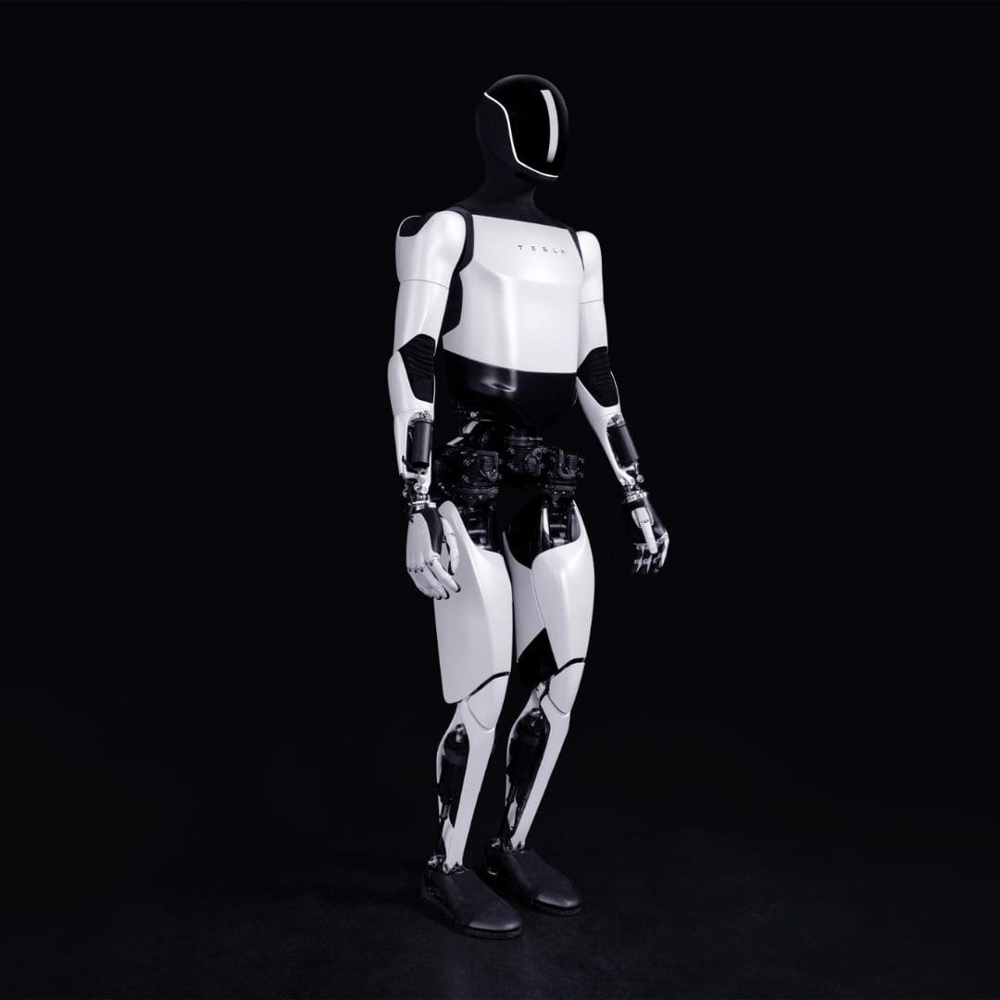
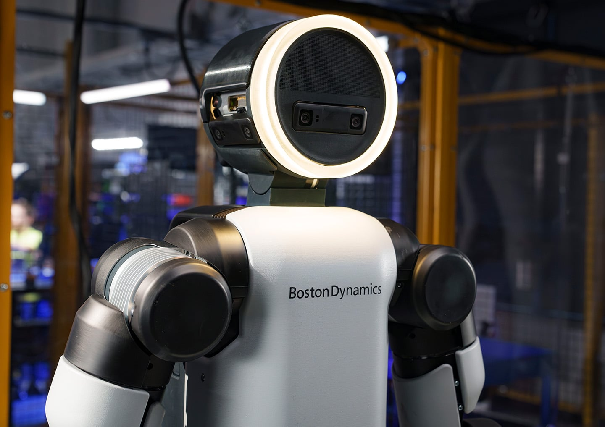
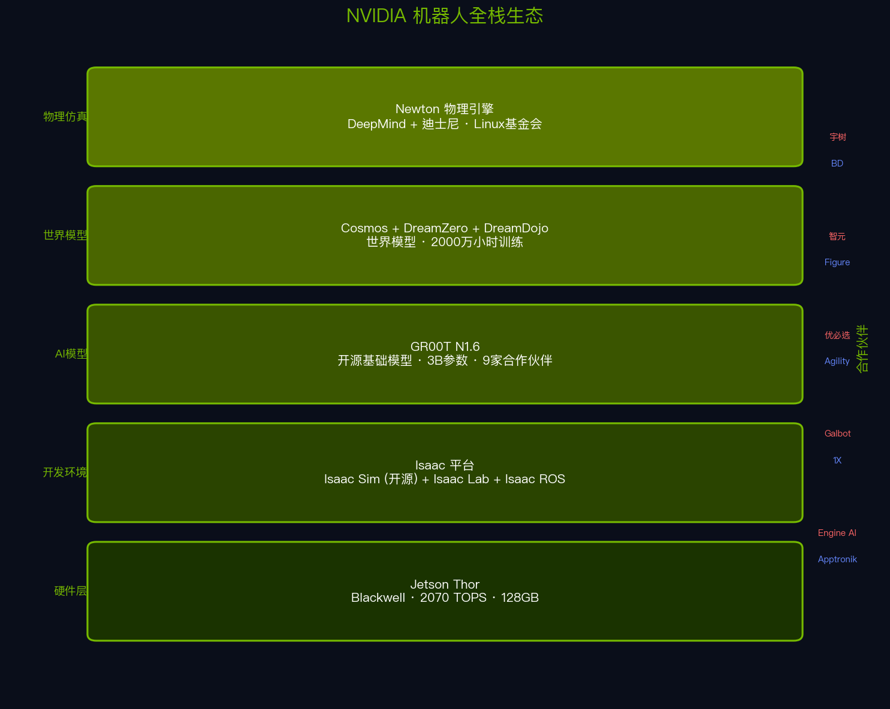
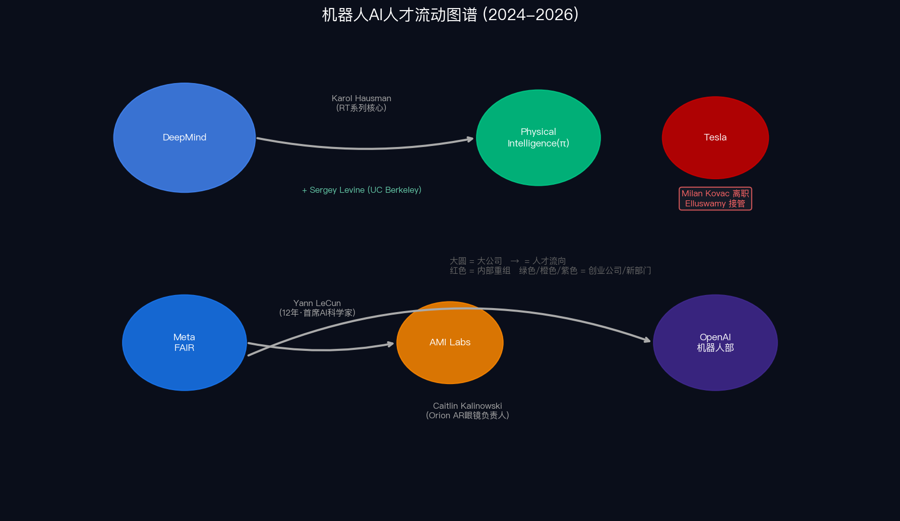
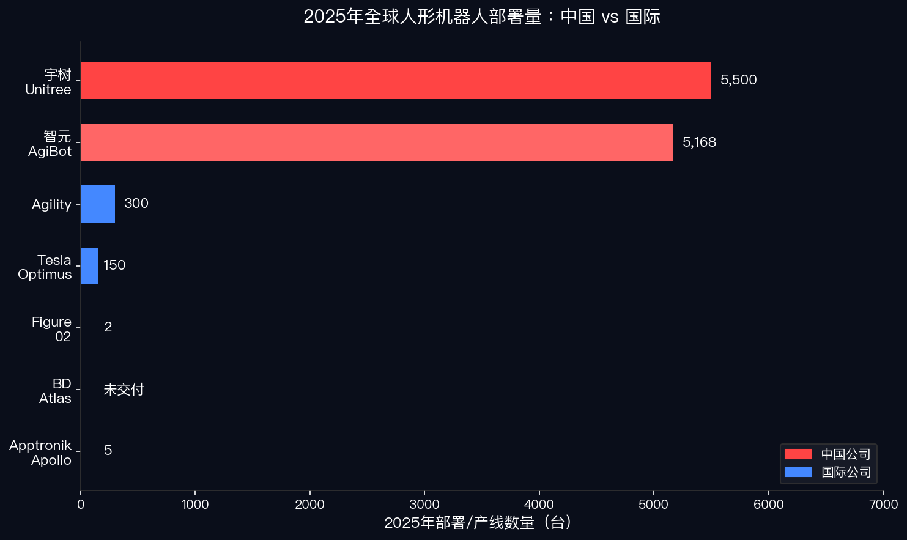

# 深度盘点机器人竞争格局（三）：一文翻完国际顶级玩家底牌

上一篇**《深度盘点机器人竞争格局（二）：大厂暗棋》**，我们拆解了国内大厂的四种棋路——造棋盘、发军火、当银行、占场景。结论是：有场景有数据的玩家，可能反客为主。

但如果把视野拉到全球，有一个问题挡在所有中国公司面前：

**国际顶级玩家手里的牌，到底有多强？**

这篇的任务是翻底牌。不看发布会，不看演示视频，不看估值——看每家公司实际能**交付什么、控制什么、缺什么**。

## Tesla Optimus：最大的赌注，最大的裂缝

马斯克2025年1月说："年底前数千台Optimus做有用的事。" 3月修正为5000台。10月修正为2000台。

2026年1月28日Q4财报电话会，他终于承认：**"Optimus仍处于研发阶段。"**

实际数字：2025年全年，**约150台**走下产线。数百台机身组装完毕但没有手——因为手部设计反复失败，前负责人Milan Kovac 6月离职后项目领导层重组，Ashok Elluswamy接管。

这不是第一次。2024年10月"We, Robot"发布会上，约50台Optimus与嘉宾互动——彭博社后来确认，**它们是人类远程操控的**。一台机器人在镜头前承认："今天我由人类辅助操控。" 马斯克事后在X上否认，但没提供反证。

2025年12月迈阿密"Autonomy Visualized"活动，一台Optimus向后摔倒。摔倒瞬间，它的手向脸部移动——和摘VR头盔的动作一模一样。特斯拉没给解释。

**但底牌不只是问题。**

Gen 3手部2026年2月曝光：每只手**22个自由度**（Gen 2仅11个），肌腱驱动系统全部内置在前臂中，灵巧度翻倍。Ashok Elluswamy（FSD负责人）接管Optimus后，把FSD的端到端神经网络直接迁移到机器人——同一套"神经世界模拟器"同时训练自动驾驶和机器人控制。

Giga Texas破土动工了专用Optimus工厂，规划年产能**1000万台**。弗里蒙特停产Model S和Model X，产线改造为Optimus生产线，目标年产**100万台**。2026年资本支出预算**200亿美元**，包含Optimus、AI算力和新工厂。

还有一个不起眼但关键的细节：特斯拉2025年10月开始在中国密集"审厂"——恒立液压（行星滚柱丝杠）、三花智控（执行器）、蓝思科技、均普智能。Gen 3的供应链有很大一部分指向中国。

> **马斯克自己说了实话："中国是目前最强的竞争对手，在中国之外没有显著的竞争者。"** ——2026年1月Q4财报电话会

特斯拉的底牌是什么？**承诺和交付之间始终有一条巨大的裂缝，但裂缝的另一边是全世界最大的制造体系和最激进的资本投入。** 150台是事实，1000万台产能规划也是事实。这两个事实同时存在，才是特斯拉最让人无法下判断的地方。

## Boston Dynamics：三十年磨一剑

如果说特斯拉的底牌是制造能力，波士顿动力的底牌是**时间**。

1992年MIT孵化。2013年Google收购。2017年卖给软银。2021年现代汽车以约$8.8亿收购80%股权。三十年，三次易主。每一次换东家，外界都说同一句话："惊艳的演示，但没有商业模式。"

CES 2026，这句话可能要改写了。

液压Atlas 2024年4月退役，**次日**电动Atlas发布——一个精心设计的媒体事件。2026年1月CES发布量产版：1.9米，90公斤，50公斤负载，IP67防护，-20°C到40°C工作温度，**电池自主更换**——机器人自己走到换电站换电池。56个自由度，关节超越人类运动范围。

更关键的是大脑：Google DeepMind的**Gemini Robotics**基础模型直接装进Atlas。这不是API调用，是VLA（视觉-语言-动作）模型在机器人本地运行，端到端控制。

**2026年Atlas全部产能已被预订。** 首批交付给现代汽车RMAC（机器人元工厂应用中心）和Google DeepMind。外部客户要等到2027年初。

商业基础也在成型。Spot机器狗已部署数百台，遍布能源、建筑、公共安全等行业。Stretch仓库机器人DHL签了**1000+台**2030年前交付协议。Gap、H&M、Otto Group都是客户。

但底牌上有一道深刻的阴影。

**波士顿动力从未盈利。** 自现代收购以来累计亏损**1.38万亿韩元**（约$10亿）。现代汽车集团不得不通过配股融资来持续输血。CEO Robert Playter 2026年2月10日退休，结束30年BD生涯。CFO Amanda McMaster代理CEO，正在全球找继任者。

现代汽车的赌注很清晰：$210亿美国投资计划的一部分是建设年产**3万台Atlas**的工厂（2028年投产），现代Mobis供应执行器，形成汽车工业级供应链。

> **三十年亏了十亿美元换来的底牌：全世界最成熟的机器人硬件工程能力，加上最强AI公司的大脑。缺牌也很明显——现代汽车的耐心。**

## Figure AI：390亿美元买了什么

Figure AI是人形机器人领域估值最高的纯创业公司。2022年5月成立，2025年9月**$390亿估值**。不到四年，从零到390亿。

核心叙事是"AI+机器人垂直整合"。但翻开底牌，故事比叙事复杂得多。

2024年2月的Series B是引爆点——$6.75亿融资，OpenAI、微软、英伟达、亚马逊、贝佐斯同时进场。同时宣布与OpenAI合作。"ChatGPT驱动的机器人"，这个概念让所有人兴奋了。

**2025年2月，Figure宣布与OpenAI分手。**

CEO Brett Adcock的理由很直接："LLM正在变得越来越聪明，但也越来越商品化。要在真实世界解决具身智能，必须垂直整合机器人AI。" Figure转而自研了**Helix**——完全内部开发的VLA模型，200Hz控制35个自由度，能同时控制两台机器人协作。2026年1月发布Helix 02：三层架构（语义推理/感知-动作/平衡-接触），在厨房场景中连续完成**61个有序动作**，4分钟不间断——完全自主。

技术上，这是一张强牌。

商业化底牌薄得多。BMW斯帕坦堡工厂的"商业部署"被《财富》杂志2025年4月调查报道拆穿：在那之前，**只有一台Figure机器人在工作，非生产时段，反复做同一件事。** 与CEO此前声称的"机器人车队在执行端到端操作"不符。Adcock威胁起诉《财富》诽谤，但没有提起诉讼。

11个月的BMW试点最终结果：两台Figure 02，每天10小时，装载**9万件零件**，参与了3万辆BMW X3的生产。数字不错——但对$390亿估值来说，这是首批商业收入的全部。

2025年11月，前首席安全工程师Robert Gruendel在联邦法院起诉Figure，声称被不当解雇。诉状中写道：机器人的手"可以碎裂人类头骨"，一台机器人曾"在不锈钢冰箱门上刻出四分之一英寸的凹槽"。他还声称安全路线图在Series C融资关闭的同月被"大幅削减"。Figure回应称指控是"捏造"。诉讼仍在进行中。

> **Figure的底牌是速度和AI能力。缺牌是$390亿估值与几乎为零的营收之间的距离——这个距离需要多少BMW试点才能填满？**

## NVIDIA：不做机器人的最大赢家

在所有顶级玩家中，NVIDIA是唯一不做机器人本体的。但它可能是最终赢家。

Jensen Huang CES 2025说："这可能是第一个多万亿美元级的机器人产业。" CES 2026说："Physical AI的ChatGPT时刻近在眼前。" Fortune记者注意到了：**一年前他说"就在眼前"，一年后他说"近在眼前"。措辞微妙地后退了。**

但不管ChatGPT时刻来不来，NVIDIA已经建好了整个基础设施。

**Isaac平台**——从仿真（Isaac Sim，已开源Apache 2.0）到训练（Isaac Lab，GPU并行强化学习）到部署（Isaac ROS），端到端开发环境。

**GR00T N1.6**——开源人形机器人基础模型，双系统架构（慢思考的VLM + 快动作的扩散Transformer），约30亿参数。9家创始合作伙伴：1X、Agility、Apptronik、Boston Dynamics、Figure、Fourier、Sanctuary、宇树、小鹏鹏行。

**Cosmos世界模型**——在**2000万小时**真实视频上训练，**9000万亿token**。让AI"想象"机器人动作的物理后果。DreamZero——14B参数世界动作模型，在未见过的任务上泛化能力是现有最优VLA的**2倍**。**DreamDojo**——在**44711小时**第一人称人类视频上训练的机器人世界模型，真实世界成功率相关系数**0.995**。

**Jetson Thor**——Blackwell架构，**2070 TOPS**算力，128GB内存，$3499开发者套件。BD、Amazon、Figure、Meta都在用。

最有意思的是中国角度。H100/H200被禁运。但**Jetson Thor目前未被列入限制清单**——宇树、智元、Galbot、Engine AI、优必选都是早期采用者。NVIDIA在深圳办了具身智能黑客松。软件工具（Isaac Sim、GR00T模型）完全开源，不受出口管制。中国公司自由下载使用。

NVIDIA还和Google DeepMind、迪士尼研究院联合开发了**Newton物理引擎**，贡献给Linux基金会，目标成为跨行业机器人物理模拟标准。

TechCrunch的标题一语中的：**"NVIDIA想当机器人的安卓。"**

> **NVIDIA的底牌是：无论谁赢了机器人竞赛，都得用它的芯片训练、它的平台仿真、它的模型微调。这张牌不需要自己赢，只需要所有人都在牌桌上。**

## 大脑之争：最强的模型，最不稳定的团队

如果NVIDIA做的是通用基础设施，那"谁给机器人装大脑"就是最激烈的竞争层。

**Google DeepMind**在机器人领域有一段黑历史——2013年一口气收了8家机器人公司（含波士顿动力）。后来从X实验室孵化出Everyday Robots，在办公室里清理餐厅桌面。2023年初，Alphabet裁员12000人，**Everyday Robots直接关闭**。十年投入，没有商业化。

然后Google做了一件聪明的事：把方向从硬件转向AI。RT-2把互联网规模的视觉语言预训练迁移到机器人，模拟基准成功率**90%**。Open X-Embodiment数据集汇聚33家机构、22种机器人平台、**100万条轨迹**——目前世界上最大的多机器人开源训练数据集。2025年Gemini Robotics：基于Gemini 2.0的VLA模型，在特定长时序任务（如午餐盒打包）上成功率达**100%**。On-Device版号称仅需少量示范就能学会新任务。

与波士顿动力的联手是战略转向的标志：**Google不做机器人，做机器人的大脑。**

但大脑之争最有意思的不是技术，是**人才流动**。

RT系列核心研究者Karol Hausman离开DeepMind，与UC Berkeley机器人学教授Sergey Levine联合创办了**Physical Intelligence（π）**——2025年11月以$56亿估值融了$6亿。它的π0通用模型在不同机器人硬件上训练同一套控制策略，2025年2月核心代码和权重开源。

Meta FAIR的Yann LeCun 2025年11月离职——12年Meta生涯的终结。导火索是Meta战略转向LLM路线，与LeCun的世界模型理念冲突。一个月后他创办了**AMI Labs**，目标$35亿估值，方向是世界模型。Meta的V-JEPA 2（12亿参数，100万小时视频训练）是最先进的机器人世界模型之一，被认为是最有潜力的机器人世界模型之一——但缔造者走了。

Meta Orion AR眼镜负责人Caitlin Kalinowski则跳去了**OpenAI**，领导新组建的机器人部门。100人三班倒采集数据。OpenAI也投了1X和Physical Intelligence。

> **人才的流向就是产业的风向。大公司培养核心人才和核心思路，但产业化机会在创业公司中实现。**

## 不在聚光灯下的潜力股

顶级底牌不只在巨头手里。有两张牌容易被忽略，但可能改写格局。

**Apptronik Apollo**——NASA血统，大厂资源。

核心团队2013年为NASA造了Valkyrie人形机器人参加DARPA挑战赛。十年后，他们把Valkyrie的经验浓缩进Apollo——1.7米，73公斤，25公斤负载，4小时续航。规格不激进，但工程成熟度高。

2025年3月开始在Mercedes-Benz柏林和匈牙利工厂试点。Jabil签了制造合作协议，用全球电子代工网络帮它量产。**2026年2月完成$9.35亿Series A，估值超$50亿**——机器人领域最大的A轮之一。投资者包括Google、Mercedes、B Capital。

Apptronik的底牌不是技术最前沿，而是**工程落地能力+大厂供应链加持**——从NASA的实验室到Mercedes的工厂，走的是务实路线。

**1X NEO**——唯一赌消费级的玩家。

当所有人形机器人公司都在争夺工厂和仓库时，1X选了一条所有人回避的路：**进家门**。

NEO——1.65米，30公斤，却能举起68公斤以上。每只手22个自由度，运行噪音只有22分贝——比图书馆还安静。定价**$20,000**，或月租$499。2026年Q3-Q4北美发货。

这个来自挪威的公司拿了OpenAI的投资，2025年7月把全球总部从挪威Moss搬到硅谷Palo Alto——8万平方英尺的新办公室，制造留在挪威。正在以$100亿+估值寻求$10亿融资。

NEO目前还需要远程操作员辅助完成复杂任务——不是完全自主。但1X的逻辑是：**家庭场景产生的具身AI训练数据，比工厂丰富得多。** 先用远程操控把机器人送进家庭，收集数据，然后逐步自主。这是一条数据飞轮的赌注。

> **Apptronik赌的是"谁帮大厂落地最快"。1X赌的是"谁第一个进家门"。两条路都还没有被验证，但方向足够独特，值得标记。**

## 部署真相：一个残酷的数字

讲完了底牌，看一组数据。

2025年全球人形机器人总销量约**1.6-1.8万台**。中国公司占**80%以上**。智元约5168台，宇树约5500台。

国际顶级玩家实际部署：

- **Agility Digit**——唯一规模化商业部署的国际人形机器人。GXO物流仓库搬了**10万+箱子**，亚马逊仓库98%任务成功率，2026年2月签下丰田加拿大工厂。RoboFab年产能1万台。
- **Tesla Optimus**——约**150台**。
- **Figure 02**——BMW试点**2台**，11个月。
- **BD Atlas**——量产版刚发布，2026年产能全部预售但未交付。
- **Apptronik Apollo**——Mercedes和Jabil试点中，个位数。

这不是量级差距，是**阶段差距**。除Agility外，所有国际人形机器人公司都还在试点或演示阶段。

而定价差距更惊人。宇树R1：**$5,900**。波士顿动力Atlas：约**$32万**。**超50倍。**

Goldman Sachs 2024年把2035年人形机器人TAM从$60亿上调6倍至**$380亿**。Morgan Stanley预测2050年达**$5万亿**。但2025年的市场现实是：年销不到2万台，八成来自中国，价格在快速下降。

还有一个结构性因素：中国控制全球**90%的重稀土加工**。每台人形机器人需要40+个伺服电机，每个电机都需要钕铁硼稀土永磁体。2025年4月中国限制7种稀土及磁体出口——马斯克被迫申请出口许可证。

**这不是贸易摩擦。这是供应链咽喉。**

## 翻完底牌之后

回到最初的问题：国际顶级玩家手里的牌，到底有多强？

翻完底牌，每一张都有王牌那一面，也有缺牌那一面：

**特斯拉**——王牌是全球最大的制造体系和最激进的资本投入。缺牌是承诺与交付之间不断扩大的信任裂缝。

**波士顿动力**——王牌是三十年硬件积累加DeepMind大脑。缺牌是十亿美元累计亏损和刚离职的CEO。

**Figure**——王牌是Helix AI的技术速度。缺牌是$390亿估值与极薄商业基础之间的距离。

**NVIDIA**——王牌是不参战但控制军火的全栈平台。缺牌是不做本体就永远依赖别人把产品做出来。

**Google DeepMind**——王牌是最先进的VLA模型和Open X-E数据集。缺牌是核心人才已经出走创业。

**Agility**——王牌是唯一规模化商业部署的记录。缺牌是总量还太小，估值远低于一众未出货的竞争者。

**Apptronik**——王牌是NASA工程血统加Mercedes+Jabil的供应链加持。缺牌是产品规格中规中矩，$50亿估值需要快速兑现。

**1X**——王牌是唯一敢赌消费级的$20,000人形机器人。缺牌是还没证明家庭场景的数据飞轮能转起来。

如果用一句话概括2026年国际机器人竞赛的真实状态：

**没有一个顶级玩家手里的牌是完整的。**

特斯拉有制造没交付，BD有技术没盈利，Figure有估值没营收，NVIDIA有生态没本体，DeepMind有模型没人才，Agility有部署没规模，Apptronik有资源没量产，1X有愿景没自主。每个人都在拼命补全自己缺的那张牌。

而在他们补牌的时间窗口里，中国公司正以50多倍的价格优势和80%的市场份额，把"量"变成"数据飞轮"。中国2025年新增工业机器人**29.5万台**（占全球54%），机器人密度470台/万人已超德日。当人形机器人真正进入这些场景，每天产生的真实操作数据量将远超国际竞争者的实验室和试点项目。

坦率说，现阶段工业机器人的路径数据和人形机器人的灵巧操作数据是两回事。但场景方的优势不仅是已有数据，更是持续产生新数据的能力和规模——这一点和上一篇的终局判断一致。

这场竞赛最反直觉的可能结局是：**赢的不是底牌最好的玩家，而是最先打完一整手牌的玩家。**

底牌决定上限，出牌速度决定胜负。

上一篇的结论是"有场景有数据的玩家可能反客为主"——那是中国视角。这一篇翻完国际底牌后，结论要修正一个字：不是"可能"，是**正在**。当每个顶级玩家都还在补牌的时候，已经在出牌的人就是领先者。

---

*降临派手记 · 罗辑执笔 · 2026-02-24*

**你认为国际机器人竞赛最终的胜负手是什么？**

**声明：** 本文所有数据截至2026年2月，基于公开信源交叉验证。人形机器人产业变化极快，文中判断可能在数月内过时。一家之言，不构成投资建议。

*数据来源：Tesla Q4 2025财报电话会实录（Motley Fool）、Bloomberg、TechCrunch、Fortune、NVIDIA官方博客、Google DeepMind论文（arXiv:2503.20020）、Boston Dynamics官方博客、IFR世界机器人报告、Goldman Sachs/Morgan Stanley研报、Rest of World、IEEE Spectrum、SCMP。*

---

**下期预告：** 《中美AI角力全局拆解》——从机器人到大模型，从芯片到数据，中美两条AI路线的全面对照。

**系列回顾：**
- [《深度盘点机器人竞争格局（一）：谁才是国内最强？》]()
- [《深度盘点机器人竞争格局（二）：大厂暗棋》]()
