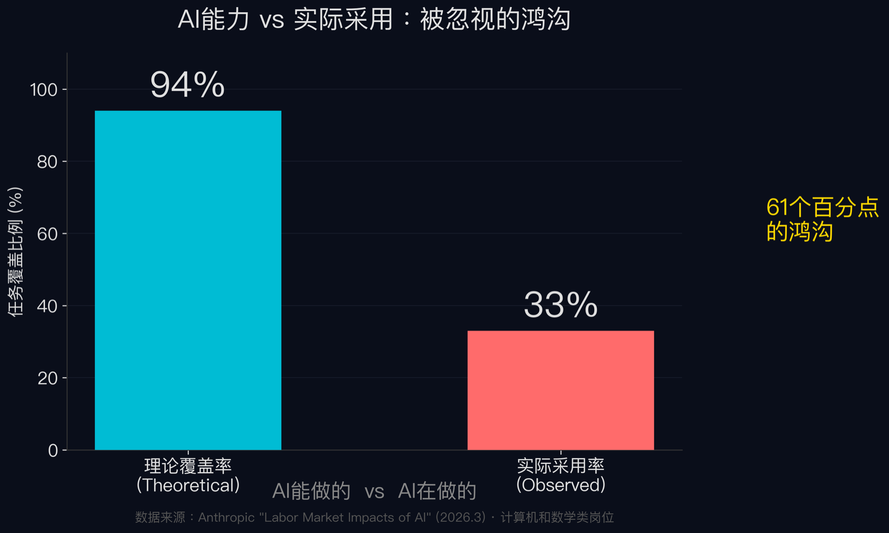
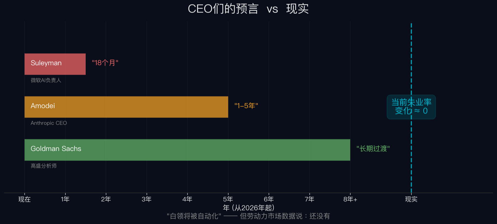
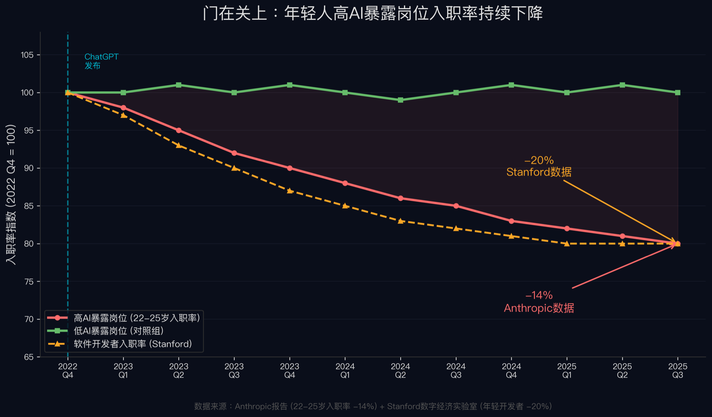
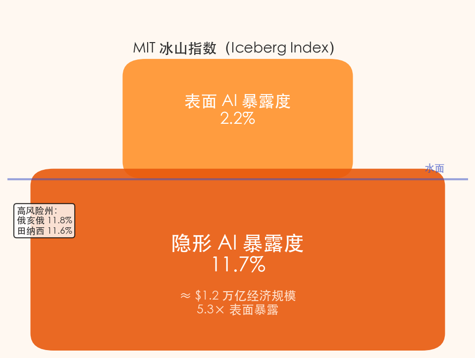
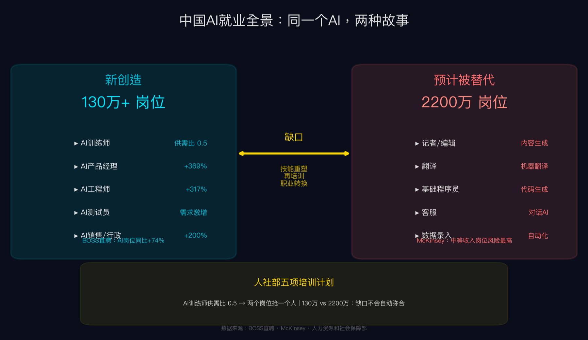
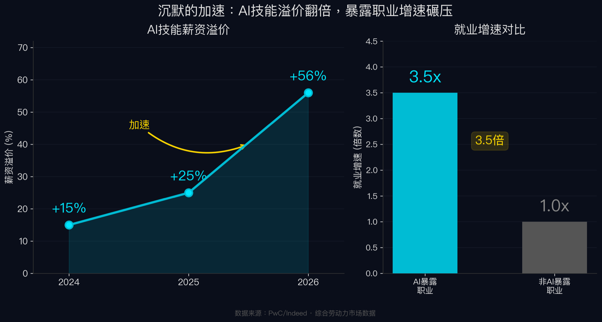

**上一篇《涟漪》里，我们追踪了中国AI模型在全球开发者平台上超越美国的产业链传导。** 那条链条的终点是一个信号：AI正在从开发者工具渗透为消费级基础设施。

这一篇，顺着另一条链。

**2026年3月5日，Anthropic（美国最强AI公司之一）发布了一份研究报告。**

报告名字很学术——《Labor Market Impacts of AI》（AI的劳动力市场影响）。但方法很新：不再估算AI"理论上能做什么"，而是直接分析数百万次真实AI对话中的工作场景，看AI"实际在做什么"。研究者给这种方法起了个名字——Observed Exposure，"观测暴露度"——结合了O*NET（美国最大的职业数据库，覆盖800多个职位）的任务分类和Anthropic自身产品的真实使用记录。

一个核心发现：计算机和数学类岗位，理论上94%的任务AI能完成。实际被采用的比例：33%。

大多数报道到这里就分成了两队。一队拿94%喊"白领药丸"，一队拿33%说"AI还早"。

**但这两个数字之间那道61个百分点的裂缝，才是整条链条的入口。**

**报告发布后48小时，链条的第一个反应是声音。**

声音来自硅谷CEO们——准确地说，来自全球AI竞赛中最有发言权的几个人。

Mustafa Suleyman——微软AI负责人（DeepMind联合创始人之一，2024年加入微软）——在2月13日接受《金融时报》专访时说：大多数白领任务将在12到18个月内被自动化。

Dario Amodei——Anthropic的CEO，就是发布那份报告的公司的老板——在1月的达沃斯论坛上给出了更具体的预测：50%的入门级白领工作将在1到5年内消失。他的原话是——"假装市场会自动找到出路而不去干预，是一种失职。"

Demis Hassabis——Google DeepMind（谷歌旗下AI研究机构）的CEO——比前两位克制，但也承认看到了初级招聘放缓的"开端"。

Goldman Sachs（高盛，全球最大投行之一）的分析师则算了一笔更大的账：全球约3亿个全职工作岗位暴露于AI自动化风险。

**CEO们几乎在比赛谁喊得更响。**

**但链条到了劳动力市场数据面前，断了。**

Yale Budget Lab（耶鲁预算实验室，隶属耶鲁大学的经济政策研究机构）在2月发布了一项研究：ChatGPT上线三年多后，美国劳动力市场未发现明显扰动。职业组合变化速率没有加快，高AI暴露职业的失业周期无统计变化。

Anthropic自己的报告，也承认了同一件事。原文用了四个字："limited evidence"——有限证据。翻译成人话：我们找了很久，没找到大规模失业的证据。

2026年3月6日，美国劳工统计局发布最新数据：2月失业率4.4%，非农就业意外减少9.2万人。有波动，但跟AI的统计相关性接近于零。斯坦福经济学家Nicholas Bloom等人通过NBER发表的一项覆盖美英德澳近6000名企业高管的跨国调查更直接：AI带来的生产力提升，远低于预期——超过90%的企业报告AI对生产力无可测量的影响。

CEO们预言的失业潮，和劳动力市场的实际数据之间，隔着一整个大陆的距离。

**那么，94%的理论能力真的没有产生任何影响吗？**

不是没有影响。是影响的形态，和所有人预想的不一样。

**不是裁员，是关门。**

Anthropic报告里藏着一组不太起眼的数字：22到25岁年轻人在高AI暴露岗位的入职率，下降了14%。

Stanford数字经济实验室（由Erik Brynjolfsson领导，他是全球最早用严格数据方法研究AI就业影响的经济学家之一）的独立研究给出了更惊人的数据：年轻软件开发者的就业人数，从2022年底到2025年7月，下降了20%。

**没有人被赶出去。门只是不再为新人打开。**

这不是大规模裁员的故事——失业率确实没涨。这是一道正在合拢的玻璃门：企业发现AI可以让现有团队产出翻倍，于是减少了新招聘。不需要裁人，只要停止招人，成本就下来了。

Dallas联邦储备银行（美国12家地区联储之一，下设经济研究部门）的研究把这种模式拆开了两层：AI在同时做两件相反的事——替代初级员工，增强资深员工。他们发现，只有年轻工人的就业下降与AI暴露度显著相关，对整体失业率的影响微乎其微。

而资深员工呢？Brynjolfsson的NBER论文——基于5172名客服代理的大规模实证研究，是同类研究中规模最大的——发现：AI助手让员工生产力平均提升14%。低经验工人速度和质量都改善了；高经验工人速度微升、质量微降——但没有人因此丢掉工作。

> 结论不是"AI抢了你的工作"，而是"AI让你的老板不需要再招新人了"。

这比大规模裁员更安静，也更难被统计数据捕捉。Yale Budget Lab的"零影响"发现，和Anthropic的"有限证据"，说的可能是同一件事：影响确实存在，只是不以失业率上升的形式出现，而是以入职机会消失的形式蔓延。

一旦企业习惯了用AI填补初级岗位的产出，这个习惯本身就会产生惯性。招聘流程调整了，岗位编制缩减了，预算重新分配了——恢复招聘的摩擦力，远大于停止招聘。

**企业的行为数据比CEO们的话诚实得多。**

Salesforce——全球最大的企业软件公司之一——在2025年9月裁掉了约4000人。CEO Marc Benioff在CNBC的采访中亲口归因于AI，原话是："I reduced it from 9,000 heads to about 5,000, because I need less heads." 但他同时宣布了2000个新的AI相关岗位。

这不是矛盾。这正是链条运作的方式：不是消灭岗位，是替换岗位的内容。你的工位可能还在，但Job Description已经变了。

Challenger, Gray & Christmas（美国最大的裁员追踪机构）的数据更精确：2026年至今，AI明确引起的裁员12,304人，占总裁员的8%。2025年这个比例是5%。自2023年以来，AI相关裁员累计91,753人。科技行业2026年至今裁员33,330人，比去年同期增长51%。

但Sam Altman（OpenAI的CEO）在2月提出了一个值得注意的判断：AI washing——有些公司拿AI当借口做本来就会做的裁员。他原话是"有些公司用AI为裁员辩护，有些是真正的AI替代"。真正的技术驱动和借技术之名的成本削减，混在同一锅数字里。

**分辨它们的方法只有一个：看新招的岗位是不是完全不同类型的岗位。** Salesforce的答案是肯定的——砍掉客服，招AI工程师。

**Salesforce是一家公司的缩影。当成百上千家企业同时做出类似选择——不是裁人，而是换人、减招、重新定义岗位——经济体的AI暴露面就远比任何单一裁员数字看起来更大。**

MIT冰山项目（MIT数字经济实验室的研究团队）发布了一个指数叫Iceberg Index。名字本身就是结论——表面之下的东西远大于看得见的。

**表面AI暴露度：2.2%。隐形AI暴露度：11.7%。**

隐形暴露是表面的5倍多，对应约1.2万亿美元的经济规模。

更违反直觉的是地理分布。AI就业风险最高的地方，不是硅谷，不是西雅图，不是纽约。**是俄亥俄（11.8%）、田纳西（11.6%）——美国传统制造业腹地，Rust Belt（铁锈地带）。**

为什么？因为那些州的后台办公、行政协调、供应链文书处理——这些支撑制造业运转但不直接参与生产的白领工作——恰恰是AI最容易覆盖的任务类型。科技中心的表现反而是招聘放缓，不是大规模裁员。

**性别数据把链条又拉深了一层。**

ILO（国际劳工组织，联合国下属的劳工权益机构）的最新数据：女性主导职业的AI暴露度29%，男性主导的16%——女性高出近一倍。高自动化风险岗位中，女性占16%，男性仅3%——5倍差距。

Brookings（布鲁金斯学会，美国最有影响力的政策智库之一）的研究精确到了人头：AI高暴露人口共3710万。其中610万人适应能力低——他们用了一个词："脆弱人口"。适应能力的评估维度包括：流动性资产（有没有应急存款）、技能可转移性（能不能转行）、本地就业市场密度（周围有没有新工作）、年龄（转岗的机会成本）。

**这610万脆弱人口中，86%是女性。**

她们集中在文员、行政助理这类岗位。不在硅谷，不在科技公司——主要分布在大学城和州首府，Mountain West（美国西部山区）和Midwest（中西部）。

更尖锐的数据来自CNBC的调查：64%的女性从不在工作中使用AI（男性55%），63%的女性缺乏工作中的AI培训。

> 面临最高自动化风险的群体，恰恰是对AI最陌生的群体。这不是巧合——这是同一个问题的两面。

**链条走到这里，还有一个方向没有看：大洋另一边。**

2026年3月的两会上，总理李强在政府工作报告中把AI定位为"就业创造的经济支柱"。不是威胁。是支柱。

数字层面：过去两年，中国AI行业创造了大量新岗位。人社部2025年5月公布了17个新职业和42个新工种，包括"生成式AI系统测试员""生成式AI动画制作人"——这些职位名称在三年前甚至不存在。

BOSS直聘的数据更直接：2025年AI相关岗位月均新发职位数同比增长74%——这个增速已经是2024年的两倍（36.5%），2023年的近9倍（8.5%）。细分领域更夸张：AI工程师岗位需求增317%，AI产品经理岗位量增幅369%，而销售、行政、法律这些"非技术岗位"的AI需求增速甚至突破200%。AI训练师供需比只有0.5——两个岗位抢一个人。

但不能只看一面。McKinsey（全球最大管理咨询公司）的预测也在：全球范围内，数以亿计的岗位面临技能升级的压力——记者、翻译、基础程序员等中等收入群体首当其冲。新创造的岗位和需要转型的存量岗位之间的缺口，不是自然衔接的。中间隔着技能重塑、再培训、职业转换的漫长通道。

人社部已经启动了五项培训计划——青年技能、农民工转岗、低空经济、新能源、AI技能。并且首次提出建立AI对就业影响的"监测、预警、响应系统"。

**中国正在赌：AI创造的新工作可以比AI消灭的旧工作更快地吸纳劳动力。**

全球其他地方呢？欧洲企业仍在增聘，但EU AI Act（欧盟AI法案）将于2026年8月生效，把招聘AI列为"高风险系统"，违规罚款最高1500万欧元或全球营收的3%。美国没有统一的联邦规则，纽约有年度偏见审计法案，加州要求30天预告和4年数据保留，其余各州各自为政。

> 同一个AI，三种政策回应：中国在创造新职业，欧洲在立法管控，美国在让市场自己消化。三条路同时展开，终点还看不到。

**把整条链条拉回来看。**

Anthropic报告说AI能覆盖94%的计算机岗位任务。现实采用33%。CEO们预言12到18个月内白领全军覆没。劳动力数据说失业率变化约等于零。

这不矛盾。它们描述的是同一件事的不同时间切面。

理论能力和实际采用之间的61个百分点，不会永远停在那里。Cognizant（全球最大IT服务公司之一）的跟踪数据显示，职业AI暴露度的年均增速已经从2%加速到9%——4.5倍。PwC（普华永道，全球四大会计事务所之一）的全球AI就业晴雨表显示，AI技能薪资溢价从2024年的25%翻倍到了2025年的56%。AI暴露职业的就业增速，是非暴露职业的3.5倍。

采用率在加速。但不是以"大规模裁员"的方式展开，而是以"重新定义岗位内容"的方式渗透。你可能还在那个位子上，但你做的事已经不一样了。做不了新事的人，不会被戏剧性地裁掉——岗位不续约，团队不扩编，部门不招新。自然磨损，静默发生。

**这才是"消失的失业潮"的真相：它没有消失，只是换了一种不会被失业率统计捕捉到的形态。**

传统经济学里有个著名的辩论——Luddite Fallacy（卢德谬误）。两百年来的规律是：每一波技术革命都会创造比消灭更多的工作。蒸汽机如此，电力如此，互联网如此。但批评者问了一个好问题：过去替代的是肌肉，这次替代的是大脑——补偿机制还能按原来的方式运作吗？

WEF（世界经济论坛）给出了一个宏观回答：到2030年，AI将替代9200万个岗位，同时创造1.7亿个新岗位——净增7800万。但这个正数里，WEF自己也写了一行注释：**41%的雇主计划因AI缩编。**

创造和消灭在同时发生。但不一定发生在同一个人身上。被替代的行政文员，不会自动变成AI训练师。

**如果顺着这条链条再往前看一步，有一个信号刚刚浮出水面。**

PwC的数据：AI暴露职业的就业增长速度是非暴露职业的3.5倍。Dallas联储的发现：AI暴露度最高的前10%行业，工资增长了8.5%，远高于全国平均。

适应了AI的人，收入在拉开差距。没有适应的人，入口在合拢。610万"脆弱人口"——大多是女性，大多是文员，分布在远离科技中心的城市——她们不是被裁员了。她们正在被一种看不见的力量，缓慢地排挤出劳动力市场的有效半径。

这不是一场失业危机。这是一场分化——一场不会出现在任何一天的头条新闻里、但五年后回头看会清晰可见的结构性分化。

> 如果你顺着这条链条继续看下去，真正的问题不是"AI会不会导致大规模失业"——三年多的数据已经给出了回答：不会，至少不以那种形式。真正的问题是：当94%的理论能力逐渐逼近实际采用时，那道正在合拢的玻璃门，会把多少人永久地留在外面？

*降临派手记 · 智子执笔 · 2026-03-13*

---

**数据来源说明**

- 核心数据：Anthropic《Labor Market Impacts of AI》(2026-03-05)
- 采用率与观测暴露度：Anthropic Economic Index January 2026 Report；底层数据集超400万次对话（Handa et al. 2025, arXiv:2503.04761）
- 年轻人入职率下降：Anthropic报告（-14%）+ Stanford Digital Economy Lab, Brynjolfsson et al.（就业人数-20%）
- Yale Budget Lab零影响研究：Yale Budget Lab (2026-02)
- 美国失业率：BLS (2026-03-06)，2月数据4.4%，非农-9.2万
- CEO/高管调查（AI生产力低于预期）：Bloom et al., NBER Working Paper w34836 (2026-02)，数据源为美联储亚特兰大分行SBU等多国央行面板
- Dallas联储双重市场：Federal Reserve Bank of Dallas Economic Research (2026-02-24)
- MIT冰山指数：MIT Iceberg Project / Digital Economy Lab (2025)
- 脆弱人口数据：Brookings Institution, Sam Manning & Tomas Aguirre
- 性别AI暴露：ILO (2026)，CNBC SurveyMonkey Women at Work Survey
- CEO言论：Amodei（达沃斯 2026-01-27 via CNBC）、Suleyman（FT 2026-02-13）、Hassabis（Benzinga 2026-02）
- Salesforce裁员：CNBC (2025-09-02)、Fortune (2025-09-02)、Fox Business
- 裁员追踪：Challenger, Gray & Christmas Job Cuts Report (2026 Q1)
- AI washing：Sam Altman via Fortune (2026-02-19)
- Goldman Sachs全球预测：Goldman Sachs Research
- WEF岗位预测：World Economic Forum Future of Jobs Report 2025（170M新增 - 92M替代）
- Cognizant暴露度加速：Cognizant New Work New World 2026 via 虎嗅
- PwC AI技能溢价：PwC Global AI Jobs Barometer 2025（56%溢价、3.5倍增速）
- Brynjolfsson NBER论文：NBER Working Paper w31161（5172名客服代理实证研究，生产力提升14%）
- 中国就业数据：人社部、BOSS直聘2025年AI人才报告 (2026-01)、Bloomberg (2026-03)、McKinsey全球预测、中国日报
- EU AI Act：HeroHunt合规分析、AI2Work (2026-08生效)，招聘AI属高风险类
